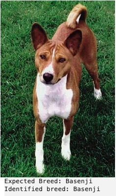

## Image Classification using AWS SageMaker  
This project is to classify 133 dog breeds using a pre-trained algorithm. It consists of three main parts; finding optimal hyperparameters, setting up a modeling using the found hyperparameters, and setting up a deployment of the modeling at Endpoints in SageMaker.  

### 1. Data set up  
- Data was downloaded from a Udacity's AWS s3 bucket.  
        - https://s3-us-west-1.amazonaws.com/udacity-aind/dog-project/dogImages.zip  
- This file was unzipped and uploaded to the project folder at s3 bucket.  
- The unzipped files contains images of 133 dog breeds with 3 subfolders; train, valid, and test.

### 2. Hyperparameter optimization  
Three hyperparameters are optimized after setting up a neural network using ResNet50 pre-trained layers with a fully connected top layer added and trained with the dog images.  
Hyperparameters optimized: learning rate, batch size, and epoch  
```
hyperparameter_ranges = {
    'learning_rate': ContinuousParameter(0.001, 0.1),
    'batch_size': CategoricalParameter([16 ,32, 64, 128, 256])
}
```
The optimal hyperparameters found are: batch_size= 64, learning_rate = 0.03620856736835261.  


### 3. Model training

Using the hyperparameters found in the previous step, the fully connected layers were further trained.  
Script used: train_model.py  
    - This file trains a model with the hyperparameters obtained from the previous step. Its content is similar to hpo.py with a slight change with the hyperparameters implemented. The images from train folder were used for training, and the ones from verify folder were used for verification. The images in test folder were never touched.  
```
model.fc = nn.Sequential(
               nn.Linear(num_features, 128),
               nn.ReLU(),
               nn.Linear(128, num_classes))
```

```
estimator = PyTorch( 
    entry_point='train_model.py',
    role=role,
    instance_count=1,
    base_job_name='debugger-dog-breeds-job',
    instance_type='ml.m5.2xlarge', 
    framework_version='1.9',
    py_version='py38',
    hyperparameters=best_hyperparameters,
    metric_definitions=metric_definitions,
    rules = rules,
    profiler_config = profiler_config,
    debugger_hook_config = debugger_hook_config
)

estimator.fit({'train': data_path}, wait=True)
```

### 4. Debugging and profiling

Debugging was performed using CloudWatch logs, and here are some of the cases of debugging.  
- There was an error message with exit due to "cannot assign to null". From the CloudWatch, I was able to fix the mistake I made in the train_model.py, where "return model" statement was missing.
- During the model deployment step, I kept getting the predict function invocation timeout. I spent days to diagnose this issue with the help of the CloudWatch logs. The log was saying "ModuleNotFoundError: No module named 'nvgpu'". Finally excluding all the possible causes one by one, I figured out that Endpoints has some issue with running GPU, which my mentor shared the same assessment. Per suggestion by the mentor, I installed nvgpu module from the jupyter notebook terminal, the problem did not go away. When I commented out the lines with GPU device at the inference.py script, it worked.

Cross entropy loss vs. training step was plotted to see if train and verification process went reasonably. 


### 5. Model deploying and predictions

inference.py script is used to deploy the model to SageMaker. Since the prediction does not cosume computer power, ml.t2.medium instance type is used.  
```
pytorch_inference_model = PyTorchModel(
            entry_point="inference.py",
            role=role,
            model_data=model_location,
            framework_version="1.9",
            py_version="py38",
            predictor_cls=ImagePredictor,
)

predictor = pytorch_inference_model.deploy(initial_instance_count=1, instance_type='ml.t2.medium')
```

Endpoint was set up successfully as follows.  


Three predictions are made. It failed to correctly predict Maltese, but succeeded in Basenji and Norwich Terrier.  
<p float="left">
  
   
  
</p>

### Insights from the model
This was the first time I developed a model using a pre-trained algorithm. The result is quite impressive, and most of all it worked. Going through setting up the Endpoint in SageMaker and finally running the predictions was an awesome experience. Along the way there are a few points in SageMaker that I could not quite understand, but that will be my next challenge.